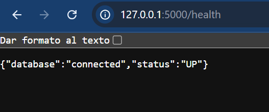
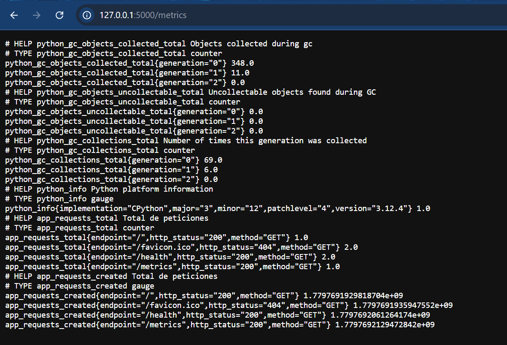
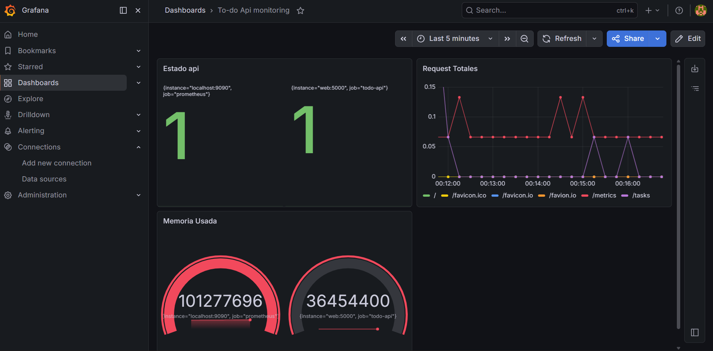

# Proyecto devops

## Estudiantes
- Diego Aristizabal
- David Parra

El objetivo fue implementar un ecosistema DevOps completo incluyendo contenerización, integración continua, observabilidad, seguridad y automatización.

## Arquitectura
El sistema está compuesto por:

- API Flask
- Base de datos SQLite
- Docker y Docker Compose
- Prometheus para métricas
- Grafana para visualización
- GitHub Actions para CI/CD

## Test unitarios 
Se implementan pruebas unitarias utilizando pytest

Test/test_app.py

Pruebas realizadas:
- Verificación del endpoint raíz
- Creación de tareas
- Validación de errores creando una tarea sin titulo(deberia dar 400)
- Healthcheck
- Consulta de tareas inexistentes(debe de dar 404)

## Dockerizacion

la app fue contenerizada usando python 3.11 slim para reducir el tamaño y mejorar el rendimiento

instalacion automatica de dependencias, usuario no root para mayor seguridad y exposicion en el puerto 5000

### docker compose
se orquestan los servicios de:
- API flask
- Prometheus 
- grafana 
- se configuran volumenes para persistencia de datos y redes personalizadas 

## CI/CD
se implementa pipeline automatico ante cada push o pull hacia la rama main.
.github/workflows/ci-cd.yml

### Etapas 
1. Checkout del repositorio
2. Configuración de Python
3. Instalación de dependencias
4. Linting con Flake8
5. Ejecución de pruebas unitarias
6. Construcción de imagen Docker
7. Validación de Docker Compose

El pipeline garantiza que el codigo no tenga errores de sintaxis, los test pasen correctamente, la imagen de docker compile bien y lo mismo con el docker compose

## Observabilidad y monitorieo 
Se implemento un sistema de observabilidad y monitoreo usando prometheus para scrapear los datos y grafana para visualizarlos en tiempo real.

La api expone endpoints para esto:
- /health -> verifica la disponibilidad de el servicio
- /metrics -> expone metricas compatibles con prometheus, estas permiten monitorear, cantidad de request, uso de memoria, rendimiento, metricas internas de python y flask
  
mediante el archivo prometheus.yml realizamos un scraping cada 15 segundos sobre el endpoint de 
/metrics de la api, para que grafana pueda consumir estas metricas y visualizarla mediante los dashboards

## Dashboards
se crearon dashboards personalizados en grafana que nos permiten ver si la app esta arriba, cuales son sus request totales a distintos endpoints de la api y la memoria utilizada

La implementación de observabilidad permite monitorear el estado y rendimiento de la aplicación en tiempo real, facilitando la detección de errores y el análisis del sistema.

## Seguridad 
la aplicacion no se ejecuta como usuario root dentro de el contenedor.
Para esto se creo el usuario: devopsuser.
Al hacer esto reducimos riesgos de privilegios y mejoramos el aislamiento de el contenedor.
Tambien al usar una imagen ligera (python3.11-slim) reducimos la superficie de ataque y quitamos dependencias innecesarias
Al usar flake8 dentro de el pipeline garantizamos que no hayan errores de sintaxis, ni malas practicas de programacion. Y al implementar github actions garantizamos que se valide automaticamente el codigo antes de permitir un build exitoso.

## Artefactos 
El pipeline construye una imagen Docker de la aplicacion de flask al utilizar el comando 
`docker build -t devops-final-seed-web:latest .` Esta imagen representa un artefacto desplegable de la aplicacion

## CALMS

## Culture
Se trabajó utilizando integración continua, automatización y colaboración, al igual que devsecops desde el principio mediante GitHub.

## Automation
GitHub Actions automatiza pruebas, linting y validación de contenedores.

## Lean
Docker permite desplegar entornos ligeros y reproducibles reduciendo trabajo manual.

## Measurement
Prometheus y Grafana permiten medir el estado y rendimiento de la aplicación.

## Sharing
GitHub facilita el versionamiento y compartición del proyecto entre los integrantes.

# Estrategia de Branching
El desarrollo se realizó utilizando Git y GitHub.

La rama principal utilizada fue:
- main
Solo utilizamos esta rama ya que al ser un proyecto corto no vimos la necesidad de crear mas ramas

Los cambios son integrados mediante commits y pushes al repositorio remoto.

## Conclusion 

Durante el desarrollo del proyecto se logró implementar un entorno DevOps funcional alrededor de una API en Flask. 

Se aplicaron prácticas fundamentales de automatización, contenerización, integración continua y observabilidad, permitiendo mejorar la calidad, mantenibilidad y monitoreo del sistema.

- Implementación de pruebas unitarias automatizadas utilizando Pytest.
- Contenerización de la aplicación mediante Docker y Docker Compose.
- Automatización del pipeline CI/CD con GitHub Actions.
- Integración de observabilidad utilizando Prometheus y Grafana.
- Aplicación de medidas básicas de seguridad y validación de código.
- Generación automatizada de builds y artefactos.

La integración de estas herramientas permitió construir un flujo de trabajo más confiable, reduciendo tareas manuales y facilitando la detección temprana de errores.